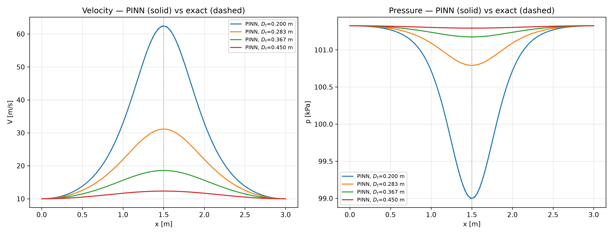
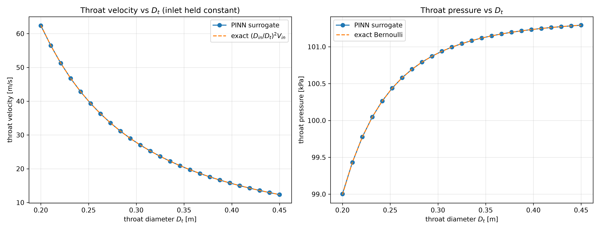
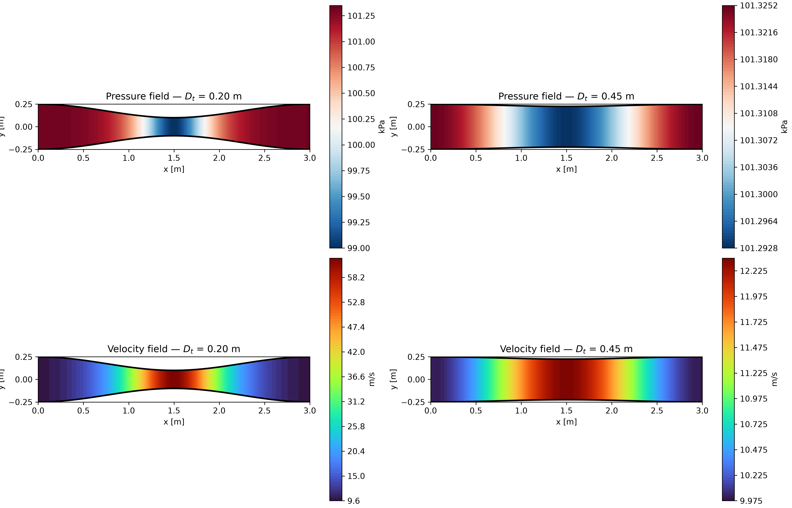
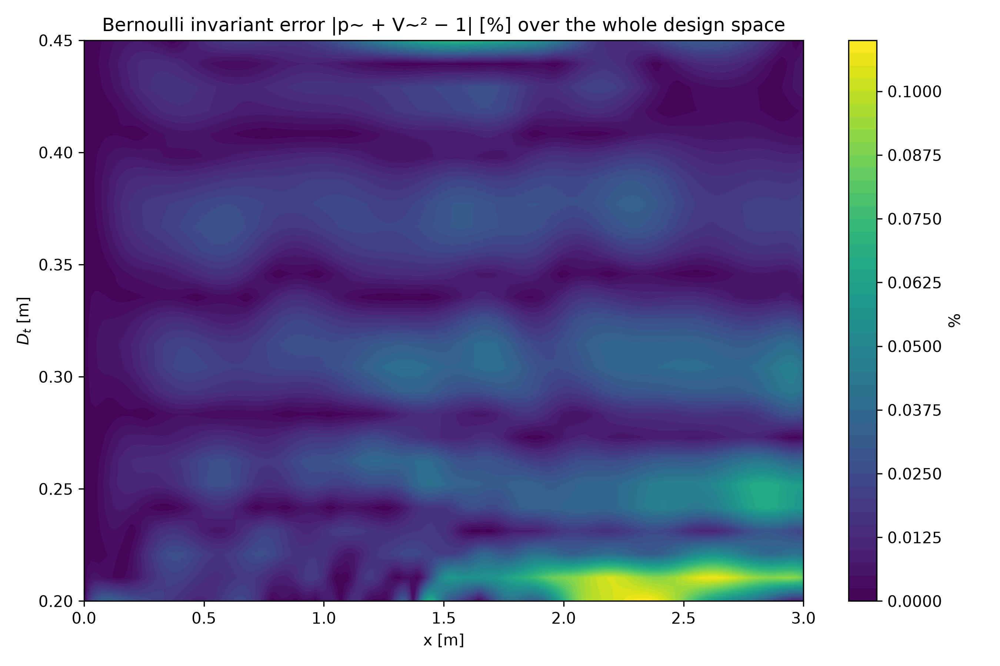
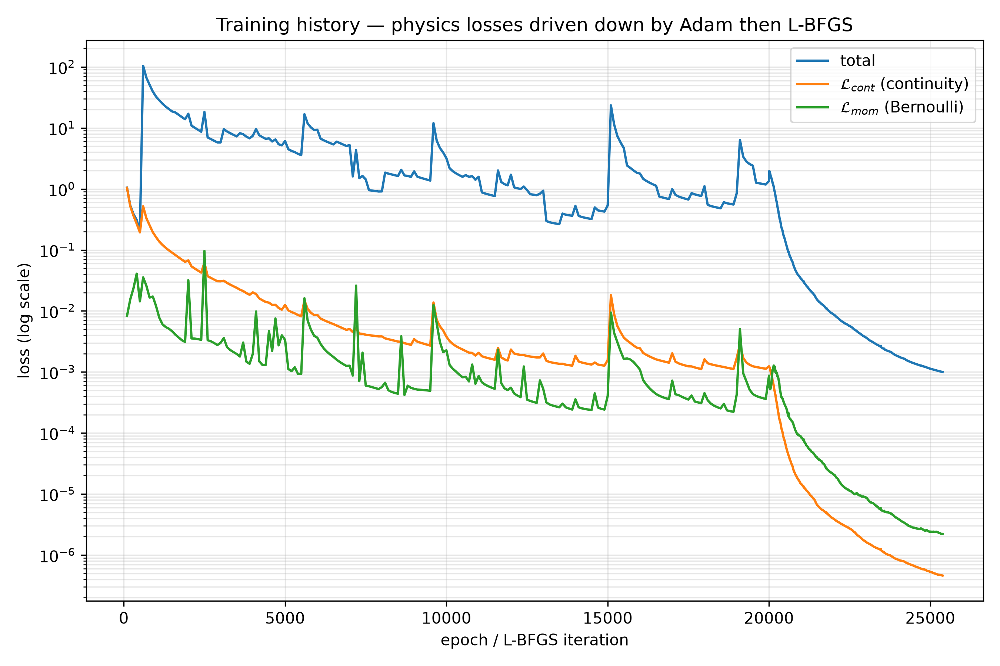
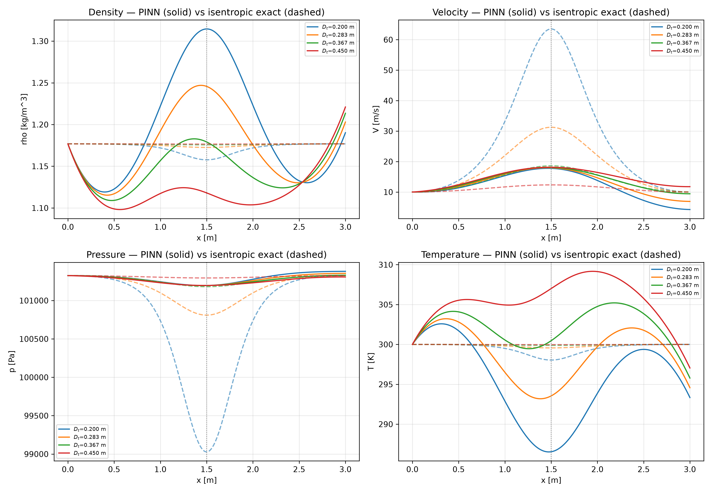
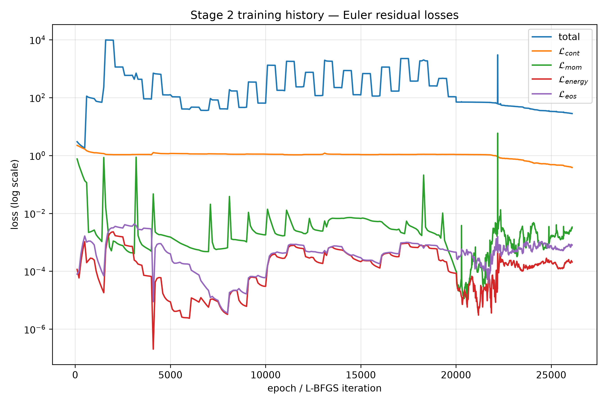
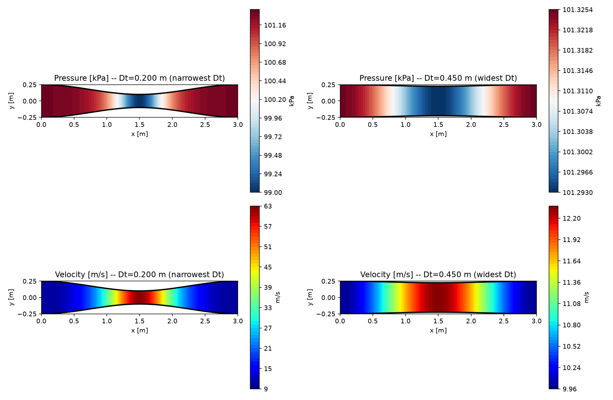

# PINNs-Bernoulli

**A Physics-Informed Neural Network (PINN) surrogate solver for computational fluid dynamics, built from scratch, taught from scratch — using water flowing through a converging–diverging venturi and Bernoulli's theorem as the complete worked example.**

This repository contains a fully runnable, parametric PINN-based CFD surrogate. It predicts velocity and pressure fields as water flows through a converging–diverging duct **without a mesh, without a CFD solver, and without any CFD training data** — the governing equations themselves are the training signal. The throat diameter is a network input, so a single trained model answers: *"what happens to the flow if I narrow the throat?"* in milliseconds. Stage 2 extends the same approach to compressible air flow (quasi-1D Euler) for when the incompressible assumption stops holding.

## Status (verified against the code in this repo, not aspirational)

- **Stage 1 (incompressible, water) — trained and passing all three acceptance gates**, on an RTX 3060, seed 1234:
  rel-L2(Ṽ) = **1.03×10⁻⁴** (gate < 1e-3) · rel-L2(p̃) = **2.33×10⁻⁴** (gate < 1e-2) · max Bernoulli-invariant error = **3.4×10⁻²%** (gate < 1%) — all on throat diameters held out of training.
- **Stage 2 (compressible Euler, air) — code complete, trained twice, NOT yet passing.** rel-L2: rho=4.1e-2, V=4.2e-1, p=2.6e-3 (passes), T=1.4e-2 — gate is <1e-2 for all four. Diagnosed cause: the continuity residual doesn't converge (momentum/energy/EOS all do) — see §10.1's figures and the "found while verifying" note pattern in §9.1 for how this class of issue gets tracked in this repo. Four candidate fixes are identified, none implemented yet.
- 7/7 tests pass (`pytest tests/ -q`): the 6 original Stage 1 tests plus one new Stage 2 physics sanity check.
- A CUDA device-mismatch bug (fresh CPU tensors passed to a GPU-resident model) was found and fixed in `evaluate.py`, `physics.py`, and `export.py` while verifying training actually ran on this machine's GPU — see §9.1. A second bug (Stage 2 silently inheriting Stage 1's water inlet speed, badly distorting its residual scaling) was found and fixed after Stage 2's first training run failed outright — see §9.2.

---

## How to read this codebase, in order

This README teaches the theory (§1–§7 below). The **source files themselves** are written as the same lesson in code — each one's module docstring states its objective, the theory it needs (self-contained, no README flipping required), and how it fits with the file before and after it. Read them in this exact order; each one only depends on the ones above it:

| # | File | You will understand |
|---|---|---|
| 1 | [`src/geometry.py`](src/geometry.py) | The duct shape as differentiable code — no network, no physics yet |
| 2 | [`src/analytical.py`](src/analytical.py) | The exact answer (closed-form + isentropic) — the "no CFD data needed" ground truth |
| 3 | [`src/physics.py`](src/physics.py) | **The core trick**: turning a differential equation into a checkable number via `torch.autograd.grad` |
| 4 | [`src/networks.py`](src/networks.py) | The network itself — forward pass, and the hard-boundary-condition architecture trick |
| 5 | [`src/losses.py`](src/losses.py) | Turning physics violations into the one scalar the optimizer descends |
| 6 | [`src/sampling.py`](src/sampling.py) | Deciding *where* to check the physics, and how held-out throat sizes prove generalization |
| 7 | [`src/train.py`](src/train.py) | The actual training loop — Adam then L-BFGS, running everything above thousands of times |
| 8 | [`src/evaluate.py`](src/evaluate.py) | Grading the trained network honestly against file #2's exact answer |
| 9 | [`src/export.py`](src/export.py) / [`src/visualize.py`](src/visualize.py) | Turning the trained function into CSV/ParaView/MATLAB/PNG output |

Stage 2 (compressible air) reuses this exact same skeleton — its additions live in the same files, clearly marked with a `# Stage 2 —` banner comment, so you can read Stage 1 first without any Stage 2 code in the way, then read the Stage 2 banners as a second pass once Stage 1 makes sense.

---

## Table of Contents

1. [Why this project exists](#1-why-this-project-exists)
2. [Why a PINN surrogate instead of a CFD solver](#2-why-a-pinn-surrogate-instead-of-a-cfd-solver)
3. [The physics: from Navier–Stokes down to Bernoulli](#3-the-physics-from-navierstokes-down-to-bernoulli)
4. [PINN theory from absolute zero](#4-pinn-theory-from-absolute-zero)
5. [How the equations become loss functions](#5-how-the-equations-become-loss-functions)
6. [Network architecture design (and why)](#6-network-architecture-design-and-why)
7. [The parametric surrogate: throat diameter as an input](#7-the-parametric-surrogate-throat-diameter-as-an-input)
8. [Repository layout — every file explained](#8-repository-layout--every-file-explained)
9. [Training protocol](#9-training-protocol)
10. [Validation against the analytical solution](#10-validation-against-the-analytical-solution)
11. [Post-processing: ParaView and MATLAB](#11-post-processing-paraview-and-matlab)
12. [How to run everything](#12-how-to-run-everything)
13. [Literature survey: everything that has been done before us](#13-literature-survey-everything-that-has-been-done-before-us)
14. [Roadmap](#14-roadmap)

---

## 1. Why this project exists

The goal is **complete, from-scratch understanding**: given the physics of internal flow (Bernoulli's theorem, continuity, momentum, eventually Navier–Stokes), how do you turn differential equations into a neural network that *is* the solver? By the end of this repository you will be able to answer, concretely and in code:

- What the governing equations are, what each term means physically, and which assumptions reduce Navier–Stokes to Bernoulli.
- What a neural network actually is mathematically (weights, biases, activations), and what forward propagation and backpropagation compute.
- How automatic differentiation gives exact PDE residuals of a network's output — the single trick that makes PINNs possible.
- How each equation (continuity, Bernoulli/momentum, boundary conditions) is converted, term by term, into a PyTorch loss function.
- How the network is designed (inputs, outputs, layers, neurons, activations, initialization, output transforms), and *why* each choice is made.
- How boundary conditions are enforced (soft penalty vs. hard architectural constraint).
- How a geometry parameter (throat diameter) becomes just another network input, turning one trained model into a **surrogate** for infinitely many nozzle designs.
- How results are exported to ParaView (`.vtk/.vtu`) and MATLAB (`.mat`) for professional post-processing.

We deliberately start with **Bernoulli's theorem in a converging–diverging nozzle** because it is the simplest flow model that still contains the essential structure of every CFD problem: a conservation law (mass), a momentum/energy law (Bernoulli), boundary conditions, a geometry, and a closed-form analytical solution to validate against. Everything learned here transfers directly to the compressible Euler equations and the full Navier–Stokes equations — which are included as staged extensions.

---

## 2. Why a PINN surrogate instead of a CFD solver

A classical CFD solver (finite volume, finite difference, finite element) discretizes the domain into a mesh and marches equations cell by cell. This is powerful but has pain points that the literature has repeatedly identified:

1. **Meshing cost.** Every new geometry (e.g., a new throat diameter) needs a new mesh and a new solve. Design sweeps of 100 throat diameters = 100 meshes + 100 solves.
2. **Many-query problems.** Design optimization, uncertainty quantification, and real-time control need *thousands* of flow evaluations. Classical CFD is too slow for that loop.
3. **Data assimilation is awkward.** Classical solvers cannot naturally absorb sparse experimental measurements; PINNs can (Raissi's *Hidden Fluid Mechanics* reconstructed full velocity and pressure fields from sparse flow-visualization data alone [Raissi et al., Science 2020]).
4. **Differentiability.** A PINN is a differentiable function of everything — position, time, *and* design parameters. You can ask for ∂(pressure)/∂(throat diameter) by autodiff, for free, enabling gradient-based shape optimization.

A **PINN surrogate** is a neural network trained so that its output satisfies the governing PDEs (by penalizing their residuals in the loss), the boundary conditions, and optionally any available data. The landmark result for our use case is **Sun, Gao, Pan & Wang (CMAME 2020)**: a physics-constrained, *label-free* deep network that learns solutions of parametric Navier–Stokes flows over varying geometries with **zero CFD simulation data** — training is driven purely by PDE residuals. That is exactly the philosophy of this repository.

Once trained, the surrogate evaluates a full flow field in **milliseconds**, for **any** throat diameter in its training range. That is the payoff.

> **Honest caveat (from the literature):** PINNs are not universally better than CFD. They struggle with shocks/discontinuities (Hong et al. 2023 needed weighted losses + hard constraints to capture normal shocks in a CD nozzle), high Reynolds number turbulence, and stiff multiscale problems (Krishnapriyan et al., NeurIPS 2021, "Characterizing possible failure modes in PINNs"). Our staged design keeps us in regimes where PINNs are provably accurate, and Section 13 documents exactly where the known limits are.

---

## 3. The physics: from Navier–Stokes down to Bernoulli

### 3.1 The reduction ladder

The full, general statement of fluid motion is the Navier–Stokes equations. Every simpler model is Navier–Stokes plus assumptions. This ladder is the conceptual backbone of the repo — the code is organized into the same stages:

| Stage | Model | Assumptions dropped | Equations | Analytical check? |
|-------|-------|--------------------|-----------|-------------------|
| 0 | **Navier–Stokes (2D, incompressible)** | none (laminar) | continuity + 2 momentum PDEs | lid-driven cavity, cylinder benchmarks |
| 1 | **Quasi-1D incompressible inviscid** = *Bernoulli regime* | viscosity, 2D/3D effects, compressibility | continuity ODE + Bernoulli/momentum ODE | **exact closed form** ✅ |
| 2 | **Quasi-1D compressible isentropic (Euler)** | viscosity, 2D/3D effects | mass + momentum + energy ODEs + EOS | isentropic area–Mach relations ✅ |
| 3 | **Parametric surrogate** (Stage 1 or 2 physics + throat diameter as input) | — | same, now ∀D_t | analytical per D_t ✅ |

Stage 1 is the heart of this repository. Stage 2 is included. Stage 0 is the stretch goal with its own module.

### 3.2 Geometry: the converging–diverging nozzle

The nozzle is an axisymmetric duct of length $L = 3\,\text{m}$. Its local diameter is defined by one smooth law with a minimum (the **throat**) at $x_t = L/2$:

$$D(x; D_t) = D_{in} + (D_t - D_{in})\sin^2\!\left(\frac{\pi x}{L}\right), \qquad x \in [0, L]$$

- $D(0) = D(L) = D_{in}$ (inlet and outlet have the same diameter),
- $D(L/2) = D_t$ (the throat — our design parameter),
- smooth everywhere, zero slope at the throat → well-behaved pressure/velocity gradients.

Cross-sectional area: $A(x; D_t) = \dfrac{\pi}{4}D(x;D_t)^2$.

**Default values:** $D_{in} = 0.5\,\text{m}$, parametric range $D_t \in [0.2,\ 0.45]\,\text{m}$, fluid = **water** at $\rho = 998\,\text{kg/m}^3$ (20°C, incompressible), inlet velocity $V_{in} = 2\,\text{m/s}$, inlet pressure $p_{in} = 101{,}325\,\text{Pa}$ (atmospheric reference). Stage 2 (§3.6) instead models compressible **air**, since that's the regime where compressibility actually matters.

> **Any incompressible, inviscid fluid works here, not just water.** $\rho$, $V_{in}$, and $p_{in}$ never appear inside the residuals the network is trained against (§3.5) — they only rescale the network's dimensionless output back into SI units at export time. The trained network itself is fluid-agnostic; swapping the config from air to water (or any other density) requires no retraining, only re-running the SI conversion.

### 3.3 What the assumptions actually mean, before we derive anything

Every equation below rests on four assumptions. Each one is doing real work — be honest about what it buys and what it costs:

- **Steady.** Nothing changes with time. Turn on the tap, let the initial sloshing settle, and from then on the velocity and pressure at any *fixed point* in the duct stay constant forever. This kills every $\partial/\partial t$ term before we even start.
- **Incompressible.** The fluid's density $\rho$ doesn't change, no matter how fast it gets squeezed through the throat. Water at everyday pressures fits this beautifully — it takes enormous pressure to compress it measurably. (Air stops fitting this once it gets fast — that's Stage 2, §3.9.)
- **Inviscid.** We ignore internal friction (viscosity). Real water has some, but for a short, smoothly-tapered duct like ours, friction losses are small next to the pressure changes the area change itself causes — so dropping viscosity is a fair first approximation, and it's the one assumption that turns a genuinely hard problem (Navier–Stokes) into an easy one (Euler → Bernoulli).
- **Quasi-1D.** We track exactly one number for velocity and one for pressure *per cross-section*, as if the fluid moves in flat slugs straight down the axis with no swirling. Valid as long as the duct's diameter changes gradually — which ours does by construction (§3.2).

Two pieces of notation used everywhere below: $x$ is distance along the duct axis, and a **streamline** is the path one fluid particle actually traces — under these assumptions, a straight line down the axis.

### 3.4 Deriving continuity — mass has nowhere to disappear to

Picture the duct as a stack of cross-sections. Take any two, at positions $x_1$ and $x_2$, with areas $A_1, A_2$ and velocities $V_1, V_2$.

In one second, a "slug" of fluid of length $V_1$ metres and cross-section $A_1$ passes through station 1. Its mass:

$$\dot m_1 = \rho \cdot A_1 \cdot V_1 \qquad [\text{kg/s} = \text{density}\times\text{volume-per-second}]$$

and the same logic gives $\dot m_2 = \rho A_2 V_2$ at station 2.

Here's the physical fact that does all the work: this is a *closed duct*. Fluid can't appear or vanish inside it, and because the flow is **steady**, nothing accumulates anywhere either — so whatever mass flows in per second at station 1 must flow out per second at station 2:

$$\dot m_1 = \dot m_2 \quad\Longrightarrow\quad \rho A_1 V_1 = \rho A_2 V_2$$

Because the fluid is **incompressible**, $\rho$ is the same everywhere and cancels straight out:

$$A_1 V_1 = A_2 V_2 \qquad \text{— true for } \textit{any} \text{ two stations}$$

which is exactly the statement "$A(x)V(x)$ is the same constant at every $x$." Write it as a function of $x$ and differentiate (a constant has zero slope):

$$A(x)\,V(x) = \text{const} \qquad\Longleftrightarrow\qquad \frac{d}{dx}\big[A(x)\,V(x)\big] = 0 \tag{1}$$

That's the continuity equation. In one sentence: **narrower duct → the same mass has to squeeze through a smaller opening → it must move faster.**

### 3.5 Deriving Bernoulli's theorem — $F=ma$ applied to a slug of fluid

Most people learn this as a fact to memorize. Here it is, built from Newton's second law — the same law you'd use for a block sliding down a ramp.

Take a small slug of fluid inside the duct: cross-section $A$, length $dx$, centred at position $x$, moving with velocity $V(x)$. Its mass:

$$dm = \rho\, A\, dx$$

**What pushes on it?** Fluid immediately behind, at pressure $p(x)$, pushes it forward with force $p\cdot A$. Fluid immediately ahead, at pressure $p(x+dx) = p+dp$, pushes back with force $(p+dp)\cdot A$. (Friction is already assumed away — inviscid — and the duct is horizontal, so no gravity term.) Net forward force:

$$F = p\cdot A - (p+dp)\cdot A = -A\,dp$$

If pressure rises in the direction of travel ($dp>0$), the net force is backward — the fluid decelerates. That sign is carrying real physics: it's the entire reason a widening duct slows the flow down.

**What's the slug's acceleration?** Not $dV/dt$ — nothing here depends on time (steady flow). Instead: as the slug moves forward by $dx$, its velocity changes by however much $V$ changes over that distance, $dV$. Acceleration is "how fast velocity changes per unit time," and the time to cross $dx$ is $dx/V$, so:

$$a = \frac{dV}{dt} = \frac{dV}{dx}\cdot\frac{dx}{dt} = V\,\frac{dV}{dx}$$

This is *convective* acceleration — a fluid particle speeds up not because time is passing, but because it's moving into a region where the flow happens to be faster (the narrowing throat ahead of it).

**Apply $F=ma$:**

$$-A\,dp = (\rho A\,dx)\left(V\,\frac{dV}{dx}\right)$$

Cancel $A$, and note $\frac{dV}{dx}\cdot dx = dV$ on the right:

$$-dp = \rho\,V\,dV \qquad\Longrightarrow\qquad dp + \rho V\,dV = 0$$

Divide by $dx$ for the differential form:

$$\frac{dp}{dx} + \rho V\,\frac{dV}{dx} = 0 \qquad\Longleftrightarrow\qquad V\frac{dV}{dx} + \frac{1}{\rho}\frac{dp}{dx} = 0 \tag{2}$$

or integrate $dp = -\rho V\,dV$ directly along $x$:

$$p + \tfrac{1}{2}\rho V^2 = \text{const}$$

That's Bernoulli's theorem, and now you know exactly where it comes from: **it is $F=ma$ for a fluid slug, with friction and gravity assumed away.** In one sentence: **speeding up costs pressure — a fluid element can't accelerate for free, and the only thing available to push it is the pressure difference across it.**

### 3.6 Boundary conditions — pinning down *which* solution

Equations (1)–(2) constrain the *shape* of $V(x)$ and $p(x)$ but not their absolute values — infinitely many flows share that shape, one for every possible inlet speed. We need one more fact to select the one flow actually happening: what's true at the inlet, which we set or measure directly:

$$V(0) = V_{in}, \qquad p(0) = p_{in} \tag{3}$$

### 3.7 Solving it by hand — the closed-form answer

From continuity (Eq. 1), $A(x)V(x)$ equals the same constant everywhere, including at $x=0$, so $A(x)V(x) = A_{in}V_{in}$:

$$V(x) = V_{in}\,\frac{A_{in}}{A(x)}$$

Substitute into Bernoulli's constant, fixed by the boundary condition at $x=0$ (where $p+\tfrac12\rho V^2 = p_{in}+\tfrac12\rho V_{in}^2$, the same sum everywhere):

$$\boxed{\;V(x) = V_{in}\,\frac{A_{in}}{A(x)}, \qquad p(x) = p_{in} + \tfrac{1}{2}\rho\left(V_{in}^2 - V(x)^2\right)\;} \tag{4}$$

Physical intuition the PINN must reproduce: where the duct **converges**, area drops → continuity forces velocity **up** → Bernoulli forces pressure **down**. The throat is the point of maximum velocity and minimum pressure. In the diverging section everything mirrors back. Every training run is validated against Eq. (4) with relative $L^2$ errors — no CFD data is ever needed, because we solved the exact answer by hand, right here.

### 3.8 Non-dimensionalization — why the network needs rescaled numbers

Here's a concrete problem: at the inlet, $x=0\,\text m$ but $p=101{,}325\,\text{Pa}$ — six orders of magnitude apart. A freshly-initialized network's weights are small random numbers; asked to output something around $10^5$ from an input around $1$, it would need to learn enormous weights before training even gets started, and the loss landscape it has to descend is badly distorted by that scale mismatch. Neural networks train well when everything — inputs *and* outputs — sits around order 1. So we rescale every quantity by a natural reference value:

$$\tilde{x} = \frac{x}{L},\quad \tilde{A} = \frac{A}{A_{in}},\quad \tilde{D}_t = \frac{D_t}{D_{in}},\quad \tilde{V} = \frac{V}{V_{in}},\quad \tilde{p} = \frac{p - p_{in}}{\tfrac{1}{2}\rho V_{in}^2}$$

Divide Eq. (1) through by $A_{in}V_{in}$ and Eq. (2)'s integrated form by $\tfrac12\rho V_{in}^2$, and every constant ($\rho$, $V_{in}$, $p_{in}$, $L$, $D_{in}$) cancels out completely — the physics becomes parameter-free:

$$\frac{d}{d\tilde{x}}\big[\tilde{A}\,\tilde{V}\big] = 0, \qquad \frac{d}{d\tilde{x}}\left(\tilde{p} + \tilde{V}^2\right) = 0, \qquad \tilde{V}(0)=1,\ \ \tilde{p}(0)=0 \tag{5}$$

and the analytical target becomes $\tilde{V} = 1/\tilde{A}$, $\tilde{p} = 1 - \tilde{V}^2$. Everything the network ever sees or produces is $O(1)$; SI units only reappear at the very last step, when `export.py` converts the trained network's output back using $\rho$, $V_{in}$, $p_{in}$. (This is also *why* the fluid — water, air, anything incompressible — never needs to be baked into the network: those constants don't appear in Eq. (5) at all.)

### 3.9 Stage 2 physics — compressible quasi-1D Euler (included extension)

When the throat velocity approaches the speed of sound, incompressibility breaks. The quasi-1D steady Euler system replaces Eq. (2):

$$\frac{d(\rho A V)}{dx} = 0, \qquad \rho V \frac{dV}{dx} + \frac{dp}{dx} = 0, \qquad h + \frac{V^2}{2} = h_0,\qquad p = \rho R T \tag{6}$$

with network outputs $(\tilde{\rho}, \tilde{V}, \tilde{p}, \tilde{T})$ and validation against the isentropic area–Mach relation $\frac{A}{A^*} = \frac{1}{M}\left[\frac{2}{\gamma+1}\left(1+\frac{\gamma-1}{2}M^2\right)\right]^{\frac{\gamma+1}{2(\gamma-1)}}$. We stay in the **subsonic branch** (no normal shocks): the literature (Hong et al. 2023; WHC-PINN 2025) shows vanilla PINNs converge to trivial/wrong solutions at shocks and need loss reweighting + hard pressure constraints — documented as future work, not hidden from you.

---

## 4. PINN theory from absolute zero

### 4.1 What a single neuron computes

Forget "neural network" for a second. One artificial neuron is arithmetic you could do on paper: it takes some numbers in, multiplies each by its own weight, adds them up plus one more number (a bias), and passes the result through a small nonlinear function:

$$z = w_1 x_1 + w_2 x_2 + b, \qquad \text{output} = \phi(z)$$

Worked example. Say $x_1=0.5$ (our $\tilde x$ — some position along the duct) and $x_2=0.7$ (our $\tilde D_t$ — some throat size), and this particular neuron has learned $w_1=0.8,\ w_2=-0.3,\ b=0.1$:

$$z = 0.8(0.5) + (-0.3)(0.7) + 0.1 = 0.4 - 0.21 + 0.1 = 0.29$$

Apply the activation function $\phi=\tanh$:

$$\phi(0.29) = \tanh(0.29) \approx 0.282$$

That single number, $0.282$, is the neuron's output — the entire "intelligence" of one neuron is a weighted sum plus a squashing function. Nothing more mysterious happens anywhere in this network; everything below is just many of these, wired together.

**Why bother with the squashing function $\phi$?** Without it, stacking layers would collapse algebraically into one giant linear equation — no matter how many layers, the network could only ever represent a straight line. A nonlinearity is what lets stacked layers bend and combine into arbitrarily complicated curves.

**Why $\tanh$ specifically**, and not the more popular ReLU (which just clips negative numbers to zero)? Because §4.6 is going to ask PyTorch for the *derivative* of this network's output — and for the PDE residuals, *the derivative of that derivative*. $\tanh$ is a smooth S-curve with a well-defined slope everywhere, at every order. ReLU has a sharp corner at zero where its second derivative doesn't exist — for a PINN, that corner would poison the physics residual, since the residual literally *is built from* a derivative of the network's output.

### 4.2 Stacking neurons: forward propagation through the whole network

One neuron gives one number. A **layer** is many neurons run side-by-side on the same input, each with its own weights — a layer of 64 neurons turns 2 input numbers into 64 output numbers. Feed those 64 numbers as the input to the *next* layer of 64 neurons, and so on for 6 layers, then a final small linear layer (no activation) produces the two numbers we actually want: a guess at $\tilde V$ and a guess at $\tilde p$.

Written compactly, with $\mathbf z^{(0)} = (\tilde x, \tilde D_t)$ the input:

$$\mathbf{z}^{(k)} = \tanh\!\left(W^{(k)} \mathbf{z}^{(k-1)} + \mathbf{b}^{(k)}\right),\quad k = 1..6; \qquad \hat{\mathbf{y}} = W^{(7)}\mathbf{z}^{(6)} + \mathbf{b}^{(7)}$$

Every $W^{(k)}$ (a grid of weights) and $\mathbf b^{(k)}$ (a list of biases) is a **trainable parameter** — this particular network has 21,122 of them, and training is nothing but slowly adjusting all 21,122 until the output starts obeying the physics from Section 3. This left-to-right evaluation — plug in $(\tilde x,\tilde D_t)$, read off $(\hat{\tilde V}, \hat{\tilde p})$ — is the **forward pass**, and it is exactly what `networks.py`'s `raw()` method computes (§8 has the real code).

### 4.3 Why can a pile of arithmetic like this possibly learn Bernoulli's equation?

This isn't hand-waving: it's a real, proven result called the **universal approximation theorem** — a network with enough neurons in one hidden layer can approximate *any* continuous function on a bounded domain to arbitrary accuracy. Our target functions, $\tilde V(\tilde x,\tilde D_t)=1/\tilde A$ and $\tilde p = 1-\tilde V^2$ (Eq. 4/5), are smooth, bounded, well-behaved functions of two variables — squarely inside what a 6-layer, 64-neuron-wide network can represent. The open question was never "can this architecture represent the answer" — it's "how do we push the weights toward that particular answer without ever being told what it is." That's the rest of this section.

### 4.4 The real problem: we have no labelled examples

Ordinary ("supervised") machine learning needs pairs: here's an input, here's the *correct* output, adjust the weights until your guesses match. A cat/dog classifier needs a pile of photos each labelled "cat" or "dog." Our situation is different: nobody ran a real experiment or a CFD simulation to hand us correct $(x,D_t)\to(V,p)$ triples anywhere in this repository. That data simply doesn't exist here, by design.

What we *do* have is something stronger than any finite pile of labelled examples: **two equations that must hold at every single point in the duct, for every throat size** (Eq. 1, Eq. 2). If a candidate function $(\hat V(x),\hat p(x))$ satisfies continuity, Bernoulli, and the boundary condition everywhere, there is exactly one such function — and it is the true flow. So instead of grading the network against known answers, we grade it against *how badly it currently violates the equations*, and push it to make that violation shrink to zero. That's the whole idea of a **Physics-Informed Neural Network**, and it's why the fluid never needs a labelled dataset: the equations themselves manufacture infinite, free, exact supervision.

### 4.5 The chain rule, refreshed

To grade "how badly the equations are violated" we need $\partial\hat{\tilde V}/\partial\tilde x$ — the network's output has to be differentiated. Here's the calculus fact that makes this tractable: if $y$ is built by composing simple functions, $y=f(g(x))$, then:

$$\frac{dy}{dx} = f'(g(x))\cdot g'(x)$$

— the derivative of a chain of functions is the product of each link's own derivative. The forward pass in §4.2 is *exactly* a long chain like this: multiply, add, $\tanh$, multiply, add, $\tanh$, ... seven times over. Every link in that chain has a trivially simple, known derivative — $\tanh'(z) = 1-\tanh^2(z)$, and multiply/add's derivatives are just the weights themselves.

### 4.6 Automatic differentiation — PyTorch does the chain rule for you, exactly

This is the one trick that makes PINNs possible at all. When PyTorch runs the forward pass, it doesn't just compute the output number — it silently records *every operation used to compute it*, building what's called a **computational graph**. Because it knows every link in that chain and every link's own derivative, it can walk the graph backward and apply the chain rule from §4.5 automatically, link by link, handing back the *exact* derivative — not an approximation, not a finite-difference estimate with rounding error, the literal calculus answer, to floating-point precision.

Tiny worked example, matching what `physics.py` actually does: suppose (for illustration) the whole network collapsed to one neuron, $\hat{\tilde V} = \tanh(w\tilde x + b)$. By the chain rule:

$$\frac{\partial\hat{\tilde V}}{\partial\tilde x} = \big(1-\tanh^2(w\tilde x+b)\big)\cdot w$$

You could derive that by hand for one neuron. For a 21,122-parameter, 7-layer network, deriving it by hand would be an enormous mess — and you never have to, because this one line, called on the network's actual output, does it generically for *any* network:

```python
torch.autograd.grad(y, x, grad_outputs=torch.ones_like(y), create_graph=True)[0]
```

That call is standing in for the entire chain-rule expansion above, computed automatically. `create_graph=True` is what keeps *this derivative itself* differentiable — because later we differentiate the *loss* (built from this derivative) with respect to the network's weights, one differentiation deeper still. This is exactly `physics.py`'s `_grad()` helper — see §8.

### 4.7 Backpropagation and training

The loss $\mathcal{L}(\theta)$ (Section 5) is one scalar number built from these residuals. **Backpropagation** applies the same chain-rule machinery from §4.6, one level up: instead of "how does the output change if I nudge the input," it asks "how does the *loss* change if I nudge *each of the 21,122 weights*" — giving $\nabla_\theta\mathcal L$, one number per weight, all computed in a single backward pass through the graph.

Picture each weight as a dial. Gradient descent is mechanically simple: for every dial, the gradient tells you which direction increases the loss, so you turn it slightly the *other* way, and repeat thousands of times. Two optimizers do this here, in sequence, each covering for the other's weakness (standard practice since Raissi et al. 2019):

- **Adam** — adapts its own step size per-dial and remembers a running average of recent gradients (momentum), which makes it robust to the wildly uneven, initially chaotic loss landscape a fresh network starts on. It does the bulk of training: `lr=1e-3`, ~20,000 epochs, and gets the loss most of the way down.
- **L-BFGS** — a quasi-Newton method: once Adam has found the right neighbourhood, L-BFGS uses *curvature* information (not just slope, but how the slope itself is changing) to take far more precise steps, squeezing the loss down another one to two orders of magnitude where Adam stalls. It's more expensive per step, which is why it only runs for the final polish.

---

## 5. How the equations become loss functions

This is the heart of the build — where Sections 3 and 4 actually meet. Take Eq. (5): both equations there are of the form "*this expression equals zero*." Pick a handful of random points $(\tilde x_i, \tilde D_{t,i})$ inside the duct — these are called **collocation points**, and they're the closest thing this project has to "training data," except they carry no answer, only a location to check. At each one, run the network forward (§4.2), differentiate its output with respect to $\tilde x$ (§4.6), and plug the result into the left-hand side of the equation. Call that number the **residual** — it measures exactly how far the network's current guess is from obeying the physics at that one point. If the network were perfect, every residual would be exactly zero, everywhere. It isn't, yet — so we square each residual (to make positive and negative violations equally bad, and to punish large violations harder than small ones), average over all the collocation points, and that average *is* one term of the loss. Shrinking the loss via gradient descent (§4.7) is mechanically identical to nudging the network toward a shape that satisfies the equations more and more exactly, at more and more points, until it generalizes to *every* point — not just the ones it was checked at.

With that mechanism understood, here is each term precisely. Each physics statement maps to one mean-squared-error term. From Eq. (5):

**① Continuity residual** (Eq. 1, penalized at $N_f$ collocation points $\{\tilde{x}_i, \tilde{D}_{t,i}\}$):

$$r_{cont} = \frac{\partial}{\partial \tilde{x}}\big[\tilde{A}(\tilde{x};\tilde{D}_t)\,\hat{\tilde{V}}\big], \qquad \mathcal{L}_{cont} = \frac{1}{N_f}\sum_{i=1}^{N_f} r_{cont}(\tilde{x}_i, \tilde{D}_{t,i})^2$$

$\tilde{A}(\tilde x;\tilde D_t)$ is known analytically (geometry module) and differentiated together with $\hat{\tilde V}$ — the chain rule handles the product. That whole line of math is these two functions, `src/physics.py` computing $r_{cont}$ and `src/losses.py` squaring/averaging it into $\mathcal L_{cont}$:

```python
# src/physics.py — the residual: compute r_cont at every collocation point
def _grad(y, x):
    """Exact dy/dx through the network's own computation graph (§4.6)."""
    return torch.autograd.grad(y, x, grad_outputs=torch.ones_like(y), create_graph=True)[0]

def residual_continuity(model, xt, dtt):
    """r_cont = d(A~ * V~)/dxt. Zero everywhere for a perfect solution."""
    xt = xt.requires_grad_(True)      # tell PyTorch: track operations on xt, we'll need d/dxt later
    v, _ = model(xt, dtt)             # forward pass (§4.2) — the network's current guess at V~
    flux = area_nondim(xt, dtt) * v   # this is A~ * V~ from Eq. (1)
    return _grad(flux, xt)            # d(A~*V~)/dxt — exactly r_cont
```

```python
# src/losses.py — the loss term: square it and average over all N_f points
def loss_continuity(model, xt, dtt):
    """L_cont — mean squared continuity residual (Eq. 1)."""
    return torch.mean(residual_continuity(model, xt, dtt) ** 2)
```

`xt` here isn't one number — it's a column of $N_f=4{,}096$ random collocation points at once (§7), so `residual_continuity` returns 4,096 residuals in one shot, and `torch.mean(...** 2)` really is computing $\frac{1}{N_f}\sum_i r_{cont,i}^2$ from the formula above, literally.

**② Momentum/Bernoulli residual** (Eq. 2) — same pattern, different quantity differentiated:

$$r_{mom} = \frac{\partial}{\partial \tilde{x}}\left(\hat{\tilde{p}} + \hat{\tilde{V}}^2\right), \qquad \mathcal{L}_{mom} = \frac{1}{N_f}\sum_{i=1}^{N_f} r_{mom}(\tilde{x}_i, \tilde{D}_{t,i})^2$$

```python
# src/physics.py
def residual_momentum(model, xt, dtt):
    """r_mom = d(p~ + V~^2)/dxt -- Bernoulli says total head is constant."""
    xt = xt.requires_grad_(True)
    v, p = model(xt, dtt)
    total_head = p + v**2             # p~ + V~^2 from Eq. (2), integrated form
    return _grad(total_head, xt)      # its slope should be zero -- that's r_mom
```

```python
# src/losses.py
def loss_momentum(model, xt, dtt):
    """L_mom — mean squared Bernoulli/momentum residual (Eq. 2)."""
    return torch.mean(residual_momentum(model, xt, dtt) ** 2)
```

**③ Boundary conditions** (Eq. 3) — two options, both implemented:

- *Soft* (penalty): $\mathcal{L}_{bc} = \big(\hat{\tilde V}(0,\tilde D_t) - 1\big)^2 + \big(\hat{\tilde p}(0,\tilde D_t)\big)^2$ averaged over sampled $\tilde D_t$ values — literally `src/losses.py`'s `loss_bc_soft`:

  ```python
  def loss_bc_soft(model, dtt_b):
      """L_bc — soft inlet-condition penalty (only when hard_bc: false)."""
      xt0 = torch.zeros_like(dtt_b)     # force x~ = 0 -- evaluate exactly at the inlet
      v, p = model(xt0, dtt_b)
      return torch.mean((v - 1.0) ** 2 + p**2)   # how far from V~=1, p~=0
  ```

- *Hard* (architectural, Lagaris-style / Sun et al. 2020): bake the BC into the output transform so it is satisfied exactly, by construction, instead of merely penalized:

$$\hat{\tilde V}(\tilde x) = 1 + \tilde{x}\,\mathcal{N}_V(\tilde x, \tilde D_t), \qquad \hat{\tilde p}(\tilde x) = \tilde{x}\,\mathcal{N}_p(\tilde x, \tilde D_t)$$

  which is `src/networks.py`'s `forward` (§4.2's $\hat{\mathbf y}$, wrapped):

  ```python
  def forward(self, xt, dtt):
      out = self.raw(xt, dtt)              # N_V, N_p — the network's two raw outputs
      n_v, n_p = out[:, 0:1], out[:, 1:2]
      if self.hard_bc:
          v = 1.0 + xt * n_v                # V~(0) = 1 exactly, for every xt including 0
          p = xt * n_p                      # p~(0) = 0 exactly
      else:
          v, p = n_v, n_p                   # raw outputs; loss_bc_soft corrects them instead
      return v, p
  ```

  At $\tilde x=0$ these give $\hat{\tilde V}=1,\ \hat{\tilde p}=0$ identically, *no matter what numbers `n_v`/`n_p` are* — the optimizer has no path to violate them. Hard BCs are the default (the literature shows they train cleaner in data-free regimes), which is why the loss list below usually has no $\mathcal L_{bc}$ term at all.

**④ Total loss** — one Python number the optimizer actually descends:

$$\mathcal{L}(\theta) = \lambda_{cont}\mathcal{L}_{cont} + \lambda_{mom}\mathcal{L}_{mom} + \lambda_{bc}\mathcal{L}_{bc} \;(+\,\lambda_{data}\mathcal{L}_{data}\ \text{if any measurements exist})$$

```python
# src/losses.py — LossWeights.total(): assembles exactly the sum above
def total(self, model, xt_f, dtt_f, dtt_b=None, hard_bc=True):
    l_cont = loss_continuity(model, xt_f, dtt_f)
    l_mom = loss_momentum(model, xt_f, dtt_f)
    parts = {"cont": l_cont, "mom": l_mom}
    total = self.values["cont"] * l_cont + self.values["mom"] * l_mom   # lambda_cont*L_cont + lambda_mom*L_mom
    if not hard_bc and dtt_b is not None:
        l_bc = loss_bc_soft(model, dtt_b)
        parts["bc"] = l_bc
        total = total + self.values["bc"] * l_bc                        # + lambda_bc*L_bc, only in soft mode
    return total, parts
```

`self.values` is the dict of $\lambda$'s (`{"cont": 1.0, "mom": 1.0, "bc": 1.0}` to start). `train.py` calls `total.backward()` on whatever this function returns — that's the moment §4.7's backpropagation actually fires, computing $\nabla_\theta\mathcal L$ for all 21,122 weights from this one scalar.

**Loss weighting matters.** Different terms have different gradient magnitudes, and imbalanced gradients cause the optimizer to satisfy one equation while ignoring another (Wang, Teng & Perdikaris 2021, "gradient pathologies"). Two supported strategies:

- `fixed`: user-set weights (Stage 1 works with all $\lambda=1$; Hong et al. found $\lambda_{mom}\approx 20$ necessary in shock cases).
- `annealing` (default): Wang et al.'s learning-rate annealing — periodically set $\hat\lambda_i = \max|\nabla_\theta \mathcal{L}_{r}| \,/\, \overline{|\nabla_\theta \mathcal{L}_i|}$ with a 0.9 moving average. This self-balances the terms. In code, `LossWeights.maybe_anneal`:

  ```python
  def maybe_anneal(self, epoch, model, parts):
      if self.weighting != "annealing" or epoch % self.anneal_every != 0:
          return False
      params = [p for p in model.parameters() if p.requires_grad]
      ref_max, means = 0.0, {}
      for name, loss_i in parts.items():
          # gradient of THIS loss term w.r.t. every weight -- reuses the exact
          # backprop machinery from §4.7, just run once per term instead of on the total
          g = torch.autograd.grad(loss_i, params, retain_graph=True, allow_unused=True)
          flat = torch.cat([gi.abs().flatten() for gi in g if gi is not None])
          means[name] = flat.mean().item()
          ref_max = max(ref_max, flat.max().item())   # max|grad L_ref|
      for name in self.values:
          lam_hat = ref_max / means[name]              # max|grad L_ref| / mean|grad L_i|  =  lambda_hat_i
          a = self.anneal_alpha
          self.values[name] = (1 - a) * self.values[name] + a * lam_hat   # 90% toward the fresh estimate
      return True
  ```

  `train.py` calls this **before** `total.backward()`, deliberately — `backward()` frees the computation graph once it runs, and this function needs that graph alive to compute `torch.autograd.grad` on each individual term.

**⑤ Where each piece lives, end to end:** ① and ② → `src/physics.py` builds the raw residual via `torch.autograd.grad`, `src/losses.py` squares and averages it; ③ → `src/networks.py`'s `forward` (hard) or `src/losses.py`'s `loss_bc_soft` (soft); ④ → `src/losses.py`'s `LossWeights.total` sums the weighted parts into one scalar, and `src/train.py`'s training loop calls `.backward()` on it every single step.

---

## 6. Network architecture design (and why)

| Choice | Value | Why |
|---|---|---|
| Inputs | $(\tilde{x}, \tilde{D}_t)$ — 2 | position + design parameter = parametric surrogate |
| Outputs | $(\hat{\tilde{V}}, \hat{\tilde{p}})$ — 2 (Stage 1); $(\hat{\tilde\rho}, \hat{\tilde V}, \hat{\tilde p}, \hat{\tilde T})$ — 4 (Stage 2) | primitive flow variables |
| Hidden layers | 6 × 64 neurons | comfortably fits smooth 1D solutions (literature uses 3×30 for nozzle Euler; we overprovision slightly for the parametric dimension) |
| Activation | `tanh` | $C^\infty$ smooth → clean high-order autodiff derivatives (HFM used `sin`; `sin` (SIREN) is available as a flag) |
| Initialization | Xavier/Glorot uniform | keeps activation variances stable at depth, avoids early saturation of tanh |
| Output transform | hard-BC ansatz (Section 5③) | exact BC satisfaction, faster convergence (Sun et al. 2020) |
| Positivity guards | $\tilde A > 0$ by construction; Stage 2: $\tilde\rho, \tilde p = \text{softplus}(\cdot)$ | prevents unphysical states during early training |
| Precision | float64 for physics paths | PDE residuals amplify round-off; float64 costs little at this size |

**The architecture, drawn out** (Stage 1; Stage 2 is identical except the final layer is 4-wide and the output transform is the softplus-shifted version from `networks.py`'s `PINNStage2`, README Section 6's positivity-guards row):

```mermaid
flowchart LR
    X("x̃ — position"):::inp
    DT("D̃ₜ — throat size"):::inp
    X --> H1
    DT --> H1
    H1("Linear 2→64 + tanh"):::hidden --> H2("Linear 64→64 + tanh"):::hidden
    H2 --> H3("Linear 64→64 + tanh"):::hidden
    H3 --> H4("Linear 64→64 + tanh"):::hidden
    H4 --> H5("Linear 64→64 + tanh"):::hidden
    H5 --> H6("Linear 64→64 + tanh"):::hidden
    H6 --> RAW("Linear 64→2, no activation<br/>raw outputs: N_V, N_p"):::hidden
    RAW --> TV("V̂ = 1 + x̃·N_V"):::transform
    RAW --> TP("p̂ = x̃·N_p"):::transform
    TV --> VOUT("V̂ — velocity guess"):::out
    TP --> POUT("p̂ — pressure guess"):::out

    classDef inp fill:#2f7b73,color:#fff,stroke:none
    classDef hidden fill:#3a4556,color:#fff,stroke:none
    classDef transform fill:#a8683a,color:#fff,stroke:none
    classDef out fill:#2f7b56,color:#fff,stroke:none
```



21,122 trainable numbers live in the six `Linear 64→64` boxes plus the two 2→64/64→2 end boxes — nowhere else. The two copper boxes (`V̂ = 1 + x̃·N_V`, `p̂ = x̃·N_p`) contain no trainable numbers at all; they're pure arithmetic on the raw network output, which is *how* the inlet boundary condition ends up impossible to violate (README Section 4.4's "architecture, not a rule" point, made visual).

---

## 7. The parametric surrogate: throat diameter as an input

This is the *surrogate* part. Instead of training one model per nozzle, $\tilde D_t$ is simply concatenated to the network input. Training samples pairs $(\tilde{x}_i, \tilde{D}_{t,i})$ by **Latin Hypercube Sampling** over $[0,1] \times [0.4, 0.9]$ (i.e. $D_t \in [0.2, 0.45]$ m), so the network sees the whole design space at once.

**What physically changes with $D_t$ (and the surrogate must capture):** smaller throat → smaller $\tilde A$ at $x_t$ → by continuity higher throat velocity $\tilde V_t = 1/\tilde A_t = (D_{in}/D_t)^2$ → by Bernoulli deeper pressure drop $\tilde p_t = 1 - \tilde V_t^2$. At $D_t = 0.2$ m: $\tilde V_t = 6.25$, $\tilde p_t = -38$ (≈ 2.3 kPa drop in SI). The surrogate reproduces this entire family instantly, and gives $\partial \hat p / \partial D_t$ by autodiff for design studies.

**Why this matters:** this is precisely the Sun et al. (2020) paradigm — geometry as input, PDE residuals as the only teacher. One training run replaces a whole CFD campaign.

---

## 8. Repository layout — every file explained

```
PINNs---Bernoulli/
├── README.md                  ← you are here (theory + how-to)
├── CLAUDE.md                  ← complete build instructions for Claude Code
├── requirements.txt           ← all dependencies, pinned minimums
├── configs/
│   └── default.yaml           ← every hyperparameter in one place (physics, network, training, export)
├── src/
│   ├── geometry.py            ← D(x; Dt), A(x; Dt), dA/dx — Eq. geometry law, nondim + SI
│   ├── physics.py             ← residuals r_cont, r_mom (Stage 1) & quasi-1D Euler residuals (Stage 2)
│   │                            via torch.autograd.grad — THE equations-to-code file
│   ├── analytical.py          ← Eq. (4) + compressible isentropic reference — ground truth for validation
│   ├── networks.py            ← MLP builder, tanh/sin activations, Xavier init, hard-BC output transforms
│   ├── losses.py              ← L_cont, L_mom, L_bc(soft), weighting strategies (fixed / LR-annealing)
│   ├── sampling.py            ← Latin Hypercube collocation sampler over (x, Dt) space; boundary samplers
│   ├── train.py               ← training loop: Adam → L-BFGS, weight annealing, logging, checkpoints
│   ├── evaluate.py            ← relative L2 vs analytical, residual maps, error metrics
│   ├── export.py              ← CSV, ParaView (.vtk/.vtu via pyvista, 2D axisymmetric reconstruction),
│   │                            MATLAB (.mat via scipy.io.savemat)
│   └── visualize.py           ← matplotlib plots: V(x), p(x) vs analytical, parametric sweeps, loss curves
├── scripts/
│   ├── run_stage1_bernoulli.py    ← one command: train Stage 1 surrogate end-to-end
│   ├── run_stage2_compressible.py ← one command: train Stage 2 (quasi-1D Euler)
│   └── run_parametric_sweep.py    ← load trained surrogate, sweep Dt, export all post-processing files
├── postprocessing/
│   ├── paraview/README.md     ← how to open .vtu, apply filters (Warp, Calculator, StreamTracer)
│   └── matlab/load_and_plot.m ← loads .mat, reproduces all key figures in MATLAB
├── tests/
│   ├── test_analytical.py     ← sanity: analytical solution satisfies residuals to machine precision
│   ├── test_gradients.py      ← autodiff vs finite-difference agreement
│   └── test_losses.py         ← each loss term = 0 when fed the exact solution
└── results/                   ← created at runtime: checkpoints, figures, .vtk/.vtu, .mat, logs
```

---

## 9. Training protocol

1. **Sample** $N_f = 512 \times 8$ collocation points (512 in $\tilde x$ × 8 LHS values of $\tilde D_t$, resampled every 1000 epochs — resampling prevents overfitting to fixed points, per the stiff-PDE PINN benchmark study).
2. **Adam**, `lr = 1e-3` (exponential decay ×0.95 / 2000 epochs), 20,000 epochs, full batch.
3. **Loss-weight annealing** every 500 epochs (Wang et al. algorithm, moving average 0.9).
4. **L-BFGS** (strong-Wolfe, `max_iter = 5,000`) polish.
5. **Validate** every 500 epochs against the analytical solution on 10,000 fresh points; track relative $L^2$ for $\tilde V$ and $\tilde p$.
6. **Acceptance gates** (the run is only "done" when): rel-$L^2(\tilde V) < 10^{-3}$, rel-$L^2(\tilde p) < 10^{-2}$ (pressure is more sensitive — it scales with $\tilde V^2$), Bernoulli constant variation < 1% across the domain, for **all** sampled $\tilde D_t$, including values never seen in training (interpolation check).

Measured wall time on an RTX 3060: ~12 minutes for the 20,000-epoch Adam phase, ~5–6 minutes for the L-BFGS polish — call it 15–18 minutes end to end, including exports and figures. (The network is tiny — 21,122 parameters — so a GPU's advantage here is real but modest; expect low tens of minutes on CPU too.)

### 9.1 A bug found while verifying on GPU

`evaluate.py`'s `validate_held_out`/`full_report`, `physics.py`'s `total_head`, and `export.py`'s `predict_si` all built fresh input tensors with plain `torch.as_tensor(...)` (which defaults to CPU) and called the model directly. That's silent on a CPU-only machine but fatal — `RuntimeError: Expected all tensors to be on the same device` — the moment the model lives on a CUDA device, since PyTorch refuses to multiply a CPU tensor against CUDA weights. Fixed by moving inputs to `next(model.parameters()).device` right before each model call and moving results back to CPU right after, at each of the three call sites. Training/loss math is unchanged — this only touches how validation and export reach the model.

### 9.2 A second bug: Stage 2 silently inherited Stage 1's fluid speed

Stage 1 and Stage 2 share one `physics:` config block. Changing `physics.V_in` to water's ~2 m/s (for the Stage 1 fluid correction) also fed that same number into Stage 2's air-flow equations — Stage 2's momentum residual scales by `kappa = p_in/(rho_in*V_in^2)`, and with air's `rho_in` (~1.18 kg/m³, not water's), that pushed `kappa` to ~21,500: a massive mismatch against the other three residuals' natural scale. Confirmed by comparing Stage 2's first training run's per-epoch loss history: three loss-weight lambdas pinned at the annealing scheme's 1e4 clip ceiling for the entire run, unable to converge. Fixed by giving Stage 2 its own `stage2.physics.V_in: 10.0` (a physically sensible subsonic air speed) and overriding `cfg["physics"]["V_in"]` with it once in `run_stage2_compressible.py`, right after config load — Stage 1 is untouched, since it loads its own config independently and never reaches that override path. This fix substantially improved Stage 2 (density error 20.6%→4.1%, temperature 8.9%→1.4%) but did not resolve the continuity-convergence issue documented in §10.1.

---

## 10. Validation against the analytical solution

Three independent checks, all automated:

- **Pointwise fields:** $\hat{\tilde V}(\tilde x)$ vs $1/\tilde A(\tilde x)$, $\hat{\tilde p}(\tilde x)$ vs $1 - \tilde V^2$ — overlay plots for several $D_t$.
- **Invariant check:** $\hat{\tilde p} + \hat{\tilde V}^2 \equiv 1$ (total head constancy) plotted as a map over $(\tilde x, \tilde D_t)$.
- **Generalization:** hold out $D_t = 0.225, 0.275, 0.325, 0.375, 0.425$ m from training; evaluate only on them. A surrogate that memorizes training geometries fails here; a physics-trained one passes, because the *equations* hold everywhere.

**Actual result of the reference training run** (seed 1234, RTX 3060, config as committed): rel-$L^2(\tilde V) = 1.03\times10^{-4}$, rel-$L^2(\tilde p) = 2.33\times10^{-4}$, max Bernoulli-invariant error $= 3.4\times10^{-4}$ (0.034%) — all three gates pass with roughly a 10× margin, on throat diameters never seen during training. What that looks like, straight from this training run's own `results/figures/`:

**(a) Solid = trained network, dashed = the exact analytical answer, at four throat diameters.** If the network had learned nothing, these would diverge; instead they sit on top of each other:



**(b) The parametric sweep** — throat velocity and pressure as $D_t$ changes, network vs exact, confirming the surrogate captures the *trend* across the whole design space, not just one geometry it happened to memorize:



**(c) The axisymmetric reconstruction** (§11 explains how a 1D field becomes this) — what the flow actually looks like, colored by pressure and velocity, at the widest and narrowest throat in the design range:



**(d) The Bernoulli-invariant error map** — $|\hat{\tilde p}+\hat{\tilde V}^2-1|$ over the *entire* $(\tilde x, \tilde D_t)$ design space, not just the four curves plotted in (a). This is the self-consistency check that has nothing to do with matching the exact solution — it only asks whether the network's own output obeys Bernoulli's theorem everywhere:



**(e) Loss history** — every term from README §5, log scale, Adam then L-BFGS:



### 10.1 Stage 2 (compressible air) — honest current result, not yet passing

Unlike the Stage 1 figures above, these do **not** show a converged solution — shown anyway, without editing them to look better, because that's what's actually in this repo right now. Density, pressure, and temperature match well; velocity visibly does not, which is the same failure the acceptance-gate numbers in the Status section report (rel-L2(V) = 42%, gate is <1%):



Loss history shows why: three of the four terms (momentum, energy, ideal-gas) drop to near-zero, while the continuity term (visible as the curve that never leaves the upper part of the plot) never converges — the diagnosis in the Status section, made visual:



**Why continuity specifically, and not the other three:** continuity (`d/dx[rho~ * A~ * V~] = 0`) is the only Stage 2 equation that couples two *independently learned* network outputs (density and velocity) through a derivative of their product — the network has to get both fields moving in a precisely coordinated way as `x` changes. Energy and the ideal-gas relation are purely algebraic (no derivative, no coordination across `x` needed — hence near-zero loss almost immediately), and momentum only couples two fields (`V`, `p`), not three. The automatic loss-weight annealing (README §5) only balances gradient *magnitude* across terms, not *direction* — it can't resolve a case where satisfying one equation's gradient pulls against another's, which is what the flat continuity curve above suggests is happening. This is a documented category of PINN failure (Wang, Teng & Perdikaris 2021; Krishnapriyan et al. 2021 — both in §13), not an isolated bug in this repo.

**Candidate fixes, not yet implemented, ranked by how much new work each is:**

1. Add a `lambda_cont_boost` config switch — same mechanism `losses.py`'s existing `lambda_mom_boost` already implements, just pinning continuity's weight instead of momentum's (which already converges fine, so boosting it further doesn't address anything).
2. Switch `stage2.loss.weighting` to `fixed` with continuity's lambda set high by hand from the start, removing the adaptive scheme's possible self-interference.
3. Reparametrize the network to output the mass flux `rho~ * A~ * V~` directly as one hard-BC'd quantity, instead of `rho~` and `V~` separately and multiplying afterward — makes continuity satisfiable by construction, the same philosophy that makes Stage 1's inlet condition unbreakable (README §4.4).
4. Leave it as documented here and move on — a legitimate stopping point for a first attempt at a coupled 4-equation PINN system.

---

## 11. Post-processing: ParaView and MATLAB

### ParaView (`.vtk` / `.vtu`)

The 1D surrogate field is reconstructed into a **2D axisymmetric field** for real visualization: for each station $x$, the duct spans $y \in [-D(x)/2, D(x)/2]$, with plug-flow $u(x,y) = V(x)$, $p(x,y) = p(x)$. `src/export.py` builds a triangle mesh with `pyvista` and writes `results/paraview/nozzle_field_<Dt>.vtu`. Open in ParaView → *Apply* → color by `p` or `V`; suggested filters (documented in `postprocessing/paraview/README.md`): **Calculator** (Mach proxy, dynamic pressure), **Warp by Vector**, **Stream Tracer**, and a parametric animation over the exported $D_t$ series.

### MATLAB (`.mat`)

`src/export.py` writes `results/matlab/nozzle_surrogate.mat` via `scipy.io.savemat` containing grids `X`, `DT`, fields `V`, `P`, geometry `D`, and the analytical references. `postprocessing/matlab/load_and_plot.m` loads it and reproduces every key figure (field maps, throat sweep curves, error plots) — no Python needed at analysis time, no toolboxes required.

The duct-shape contour plots reconstruct the same axisymmetric field the Python `colored_cfd_fields.png` uses (README §10): every axial station's `D` gives the duct's local half-width, `V`/`P` are painted across that width uniformly (plug flow — quasi-1D has no radial variation to show), and the duct wall is drawn on top from the same `D` array:



*(This particular image was rendered in Python from the same `.mat` file, reproducing `load_and_plot.m`'s exact array operations, as a way to verify that script's logic without a MATLAB license on hand — see the file's own comments for the identical array construction.)*

---

## 12. How to run everything

```bash
git clone https://github.com/harsh147-github/PINNs---Bernoulli.git
cd PINNs---Bernoulli
python -m venv .venv && source .venv/bin/activate     # or conda
pip install -r requirements.txt                        # torch, numpy, scipy, matplotlib, pyvista, pyyaml, pandas, tqdm, imageio

python scripts/run_stage1_bernoulli.py --config configs/default.yaml   # train the Bernoulli surrogate
python scripts/run_stage2_compressible.py --config configs/default.yaml # compressible extension
python scripts/run_parametric_sweep.py  --checkpoint results/checkpoints/stage1_final.pt \
        --dt-min 0.20 --dt-max 0.45 --n 25                              # sweep throat, export ParaView+MATLAB
pytest tests/ -q                                       # physics/unit sanity checks
```

Outputs land in `results/`: figures (`figures/`), ParaView files (`paraview/`), MATLAB file (`matlab/`), checkpoints (`checkpoints/`), logs (`logs/`).

---

## 13. Literature survey: everything that has been done before us

Annotated map of the field this repo stands on — every claim in this README traces here.

**Foundations**
- **Raissi, Perdikaris, Karniadakis (2019), *Physics-informed neural networks*, J. Comput. Phys. 378:686–707** — the founding paper: PDE residuals in the loss, autodiff, Adam→L-BFGS. Also the 2017 two-part arXiv preprints. Code: `github.com/maziarraissi/PINNs` (TensorFlow v1).
- **Lagaris, Likas, Fotiadis (1998), IEEE TNN** — 20 years earlier: ANNs as trial solutions for ODEs/PDEs with hard-coded BCs. The intellectual ancestor of our hard-BC ansatz.
- **Karniadakis et al. (2021), *Physics-informed machine learning*, Nature Reviews Physics 3:422–440** — the field-level review: why physics-informed learning beats black-box ML when data is scarce; capabilities and honest limitations.

**PINNs for fluid mechanics / Navier–Stokes**
- **Raissi, Yazdani, Karniadakis (2020), *Hidden Fluid Mechanics*, Science 367:1026–1030** — Navier–Stokes-informed network (6 outputs, 10×50/layer per output, `sin` activation) recovers velocity & pressure from passive-scalar data alone; geometry/BC-agnostic; differentiable surrogate used for wall shear stress & forces.
- **Jin, Cai, Li, Karniadakis (2021), *NSFnets*, J. Comput. Phys. 426:109951** — systematic PINN formulation of incompressible Navier–Stokes (velocity–pressure and vorticity–velocity forms), laminar→turbulent limits.
- **Sun, Gao, Pan, Wang (2020), *Surrogate modeling for fluid flows based on physics-constrained deep learning without simulation data*, CMAME 361:112732** — **the single most important reference for this repo**: parametric geometry as network input, hard BC enforcement, *zero* CFD data, vascular-flow surrogates + uncertainty propagation.

**Nozzle flows & compressible PINNs (our exact problem family)**
- **Hong et al. (2023), *Continuous and discontinuous compressible flows in a converging–diverging channel solved by PINNs without data*, arXiv:2306.11749 / Sci. Rep.** — quasi-1D Euler CD nozzle; vanilla PINNs collapse to trivial solutions at shocks; fixed by ~20× momentum-loss weight + hard pressure BCs. Their nozzle law and Pb regimes inform our Stage 2.
- **WHC-PINN (2025), *PINN with weighted loss and hard constraints for hyperbolic conservation laws*, Sci. Rep.** — gradient-based weighting + global conservation term + pressure-only hard constraints; captures Riemann problems and nozzle shocks with a unified solver.
- **Anderson, *Computational Fluid Dynamics: The Basics with Applications*, Ch. 7** — the classical quasi-1D nozzle CFD tutorial (MacCormack scheme) — what we replace with a PINN.

**Training dynamics & failure modes**
- **Wang, Teng, Perdikaris (2021), *Understanding and mitigating gradient pathologies in PINNs*, SIAM SISC** — loss terms compete; learning-rate annealing algorithm (implemented here) + improved architectures.
- **Wang, Yu, Perdikaris (2022), NTK-based weighting, JCP** — weights from Neural Tangent Kernel eigenvalues.
- **Krishnapriyan et al. (2021), *Characterizing possible failure modes in PINNs*, NeurIPS** — why PINNs fail on stiff/multiscale problems and how curriculum/regularization help.
- **Stiff-PDE benchmark review (2023), Springer Comput. Mech.** — DeepXDE vs NVIDIA Modulus baselines, Fourier/modified-Fourier/DGM architectures, SDF weights, importance sampling; resampling beats fixed collocation.

**Parametric PINNs for design**
- ***Investigating the Effects of Labeled Data on Parameterized PINNs for Surrogate Modeling* (2024), MDPI Fluids 9(12):296** — parametric PINN design optimization (drag reduction over a forward-facing step); small amounts of labeled data + low data-loss weight improve parametric surrogates; gradients w.r.t. design parameters from autodiff.

**Reference codebases worth reading**
- `maziarraissi/PINNs` — the original (TF1). `rezaakb/pinns-torch` — PyTorch re-implementation, up to 9× faster via CUDA graphs (NeurIPS DLDE 2023). `chen-yingfa/pinn-torch` — clean minimal PyTorch Navier–Stokes PINN. `pjuangph/PINN-Torch` — tutorial-style, includes Euler/shock-tube limitations demo. `parfenyev/2d-turb-PINN` — PINN inference from PIV data. **Frameworks:** DeepXDE (multi-backend, beginner-friendly), NVIDIA Modulus/PhysicsNeMo (industrial scale).

---

## 14. Roadmap

- [x] Stage 1 — parametric incompressible Bernoulli surrogate (trained, all acceptance gates pass — §9.1, §10)
- [x] Stage 2 — quasi-1D compressible Euler code (network, residuals, isentropic validation, training loop, run script) — trained twice, **not yet passing: continuity residual doesn't converge, see §10.1 / §9.2 / Status**
- [ ] Stage 2 — fix continuity convergence (4 candidate approaches identified, none implemented — see §10.1)
- [ ] Stage 2 — ParaView `.vtu` / MATLAB `.mat` export parity with Stage 1 (currently CSV + figures only)
- [ ] Stage 2b — shock capturing (weighted loss + hard pressure constraints, per Hong et al. / WHC-PINN)
- [ ] Stage 0 — 2D incompressible Navier–Stokes nozzle (NSFnets VP formulation, `sin` activations)
- [ ] Data assimilation mode — inject sparse pressure-tap measurements (`λ_data` term already stubbed)
- [ ] Gradient-based throat optimization: maximize thrust/recovery using $\partial p/\partial D_t$ from the surrogate
- [ ] Uncertainty quantification over $\rho$, $V_{in}$ via the parametric surrogate
